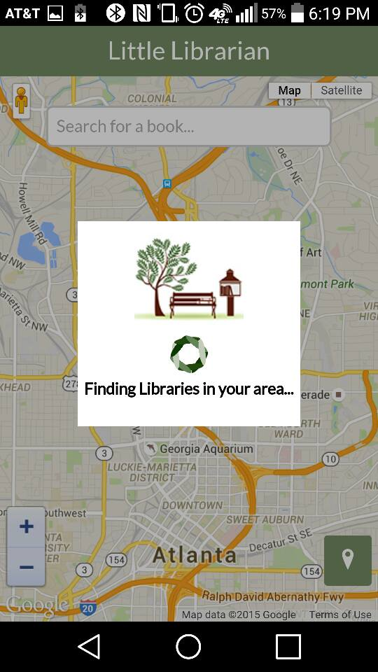
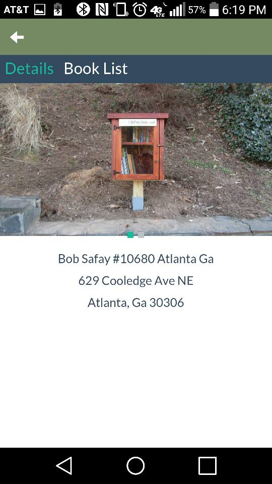

I participated in AT&T's mobile app hackathon and my team ended up winning "Best App From a Women Led Team" as a part of Team Little Librarian.

<span class="more"></span>

Team Little librarian formed to find a modern solution to keeping track of the content to [little free libraries](http://littlefreelibrary.org/) 
and create an IoT solution for them. In the scope of the hackathon we decided to build a mobile app
and a hardware solution.  

### Mobile App

We started with a mobile app written in [Sencha Touch](https://touch.sencha.com).  The app presents
you with the locations of libraries. You can select each item on the map to find more info on each
of these libraries. All of the data comes from the salesforce api (lol) that the the little free libary
website pulls it's info from.  

 



From there we set out to track the books in the library. To do this we used AT&T's [m2x](https://m2x.att.com/) iot platform.
Where we employed a novel concept of making the books devices in the cloud and the mobile app the
communication platform that tells the cloud where the devices are sent.  Interestingly we were able
to implement this better than we initially thought and tracked books in the app without spinning up
a database for ourselves.  To identify books by their isbn's we brought in google books' api and
used that for cover images as well.  


### Hardware

The hardware solution used [monteinos](http://lowpowerlab.com/moteino/), a arduino clone with a built-in RF module. We used a simple magnetic door
sensor to discover when the door to the libray was opened the node monteino would send an encrypted
message to the gateway monteino.  Using the RFM69 library sending that message was as easy as:

```c
    // if the button state has changed:
    if (reading != buttonState) {

      buttonState = reading;
        if (buttonState == HIGH) {
            Serial.print("Sending[");
            Serial.print(6);
            Serial.print("]: ");
            for(byte i = 0; i < 6; i++)
              Serial.print((char)openPayload[i]);
          
            if (radio.sendWithRetry(GATEWAYID, openPayload, 6))
              Serial.print(" ok!");
            else Serial.print(" nothing...");
            Serial.println();
            Blink(LED,30,3);
        } else {
            Serial.print("Sending[");
            Serial.print(7);
            Serial.print("]: ");
            for(byte i = 0; i < 7; i++)
              Serial.print((char)closePayload[i]);
          
            if (radio.sendWithRetry(GATEWAYID, closePayload, 7))
              Serial.print(" ok!");
            else Serial.print(" nothing...");
            Serial.println();
            Blink(LED,30,3);
        }

        // set the LED:
        digitalWrite(LED, buttonState);
    }

```

On the other end we had another gateway monteino attached to a small computer (raspberry pi)
running a python script waiting for messages on the serial port.  When the message for open would
come it would send a request to m2x updating the status.  


Pretty neat stuff... We were able to make a nearly complete solution using a wide range of
technologies in under 24 hours.  The complete source is on github. 

-Jeff


